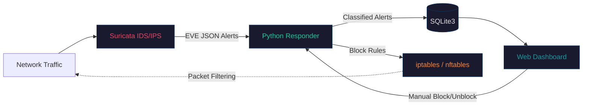

# SecNet

**Automated Network Incident Detection and Response System**

SecNet is a containerized security platform that combines real-time network threat detection (Suricata IDS/IPS), automated incident response with IP blocking, and forensic alert analysis through a unified web dashboard. Built as a final degree project for the ASIR program (Administracion de Sistemas Informaticos en Red), graded 10/10.

---

## Architecture



---

## Key Features

**Threat Detection** -- Suricata 7.0+ engine with 11 custom detection rules monitoring network traffic in real time. Alerts are parsed from EVE JSON logs and classified by severity.

**Automated Response** -- Detected threats trigger automatic IP blocking via iptables/nftables. No manual intervention required for critical and high-severity incidents. Manual override available through the dashboard.

**Forensic Analysis** -- Each alert stores full packet metadata: source/destination IPs, ports, protocol, timestamp, rule signature, and severity. Detailed forensic view available per alert.

**Dashboard and Visualization** -- Dark-themed responsive web interface with real-time alert feed, severity filtering, blocked IP management, and Chart.js visualizations for alert trends and distribution.

---

## Alert Classification

| Severity | Level | Examples |
|---|---|---|
| Critical | 1 | Active exploitation attempts, known CVE signatures |
| High | 2 | Brute force attacks, port scan sweeps |
| Medium | 3 | Suspicious protocol usage, unusual traffic patterns |
| Low | 4 | Policy violations, informational probes |
| Informational | 5 | DNS queries to flagged domains, connection metadata |

---

## Tech Stack

| Component | Technology | Role |
|---|---|---|
| IDS/IPS Engine | Suricata 7.0+ | Network traffic analysis and rule-based detection |
| API / Automation | Python 3.9, Flask | Alert processing, automated response, REST API |
| Dashboard | PHP, Apache | Web interface, alert visualization |
| Database | SQLite3 | Alert and blocked IP storage |
| Visualization | Chart.js | Alert trend charts and severity distribution |
| Packet Filtering | iptables / nftables | Automated and manual IP blocking |
| Infrastructure | Docker, Docker Compose | Containerization, orchestration, health checks |

---

## Screenshots

| Dashboard | Alert Detail |
|---|---|
| <!-- docs/screenshots/dashboard.png --> | <!-- docs/screenshots/alert-detail.png --> |

| Real-Time Alerts | Blocked IPs |
|---|---|
| <!-- docs/screenshots/alerts.png --> | <!-- docs/screenshots/blocked-ips.png --> |

---

## Quick Start

```bash
git clone https://github.com/diegoperezg7/TFG-SecNet.git
cd TFG-SecNet
docker compose up -d
```

The dashboard is available at `http://localhost:8080`. The Flask API runs on port `5000`.

To monitor a specific network interface, edit `suricata/suricata.yaml` before starting the containers.

---

## Architecture Details

SecNet runs as a three-container system orchestrated with Docker Compose:

**Container 1 -- Suricata** operates in IDS/IPS mode, inspecting network traffic against 11 custom rules plus the default ruleset. Alerts are written to EVE JSON logs shared with the Python Responder via a Docker volume.

**Container 2 -- Python Responder** runs a Flask API that continuously parses Suricata's EVE logs, classifies alerts by severity, stores them in SQLite, and executes automated IP blocking for threats above the configured threshold.

**Container 3 -- Web Interface** serves a PHP dashboard on Apache that consumes the Flask API. Provides real-time alert monitoring, forensic detail views, severity filtering, and blocked IP management.

All three containers communicate over an internal Docker network. Health checks ensure automatic restart on failure.

---

## Custom Detection Rules

11 custom Suricata rules covering:

- **Port scanning** -- SYN scan detection, sequential port probing
- **Brute force** -- SSH and HTTP authentication flood detection
- **Suspicious protocols** -- IRC, Telnet, non-standard protocol usage
- **Known attack patterns** -- SQL injection signatures, directory traversal
- **Exfiltration indicators** -- Large outbound transfers, DNS tunneling patterns

Rules are defined in `suricata/rules/custom.rules` and can be extended without rebuilding the container.

---

## Repository Structure

```
TFG-SecNet/
├── docker-compose.yml
├── suricata/
│   ├── Dockerfile
│   ├── suricata.yaml
│   └── rules/
│       └── custom.rules
├── python-responder/
│   ├── Dockerfile
│   ├── responder.py
│   └── requirements.txt
├── web-interface/
│   ├── Dockerfile
│   ├── index.php
│   ├── api/
│   ├── css/
│   └── js/
└── README.md
```

---

## Academic Context

Developed as the final degree project (Trabajo de Fin de Grado) for the Tecnico Superior en Administracion de Sistemas Informaticos en Red (ASIR) program. Graded 10/10.

---

## License

MIT License. See [LICENSE](LICENSE) for details.
